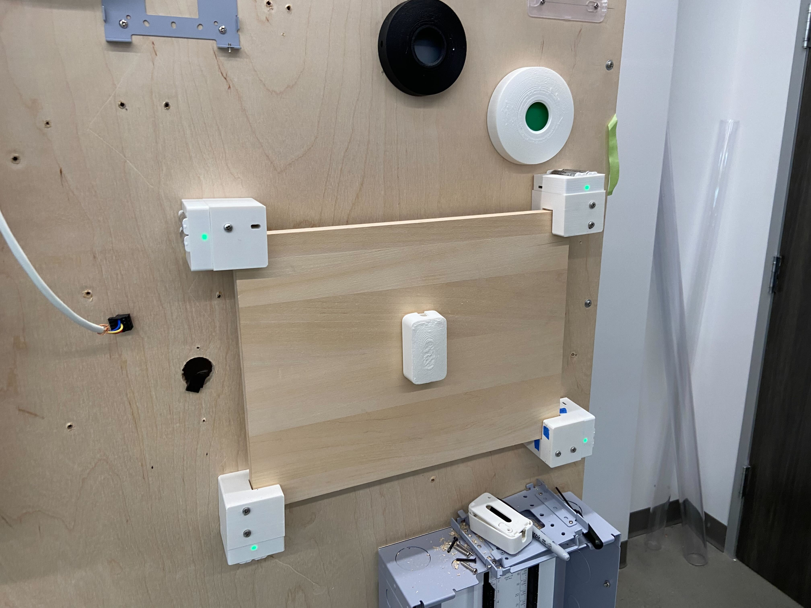

# Background

For this project I wanted to design a modular device that could be used to measure forces on wall mounted products. It works by clamping a piece of 3/4" ply in all corners, with 4 sensors in each corner. You can choose the size of the ply according to the product you are trying to test, and screw your product into the ply. The original goal was to measure how much force it takes to rip wall mounted products off the wall, but it could be used for pretty much anything. The configuration of the sensors allows AllSpark to measure forces normal to the wood (1 axis), shear forces (2 more axes), and torque in all three axes.

# Sensors

I used the [Uneo GHF10](https://www.uneotech.com/uploads/product_download/tw/GHF10-500N%20ENG.pdf) for this project. It is a thin, flexible, piezoresistive force sensor designed to measure applied force from 0 to 500 N. It operates by converting mechanical pressure into a change in electrical resistance using a proprietary conductive polymer film. The sensor offers high linearity (≥99% R²), fast response (~0.1 ms), and a long lifespan (up to 10 million actuations). It’s ideal for embedded, robotic, and wearable applications requiring accurate, analog force sensing.

The sensor consists of multiple layers: a top electrode, a spacer with a sensing window, and a bottom electrode printed with piezoresistive ink. When pressed, the top and bottom electrodes make contact through the window. In this way, the applied pressure modulates the contact area and density of conductive paths, reducing overall resistance. With no applied force, the resistance is in the MΩ range, and with the full 500N force applied, the resistance is less than 1 kΩ. 

# PCB

I designed a custom 4 layer PCB for this project around an ESP32-C3-MINI-1-N4. AllSpark runs on x2 [L91](https://data.energizer.com/pdfs/l91.pdf) batteries under normal operating circumstances, but can also be powered over micro USB, which is also the primary flashing method. 

### Schematic


The circuit is sectioned as follows: 
- Green - battery circuit
- Orange - USB circuit
- Red - dual ideal diode ORing circuit to use micro USB power when both sources are provided
- Purple - ESP32, EN, BOOT, peripherals
- Blue - analog circuitry to feed into ADCs

### Layers, layout, routing

The board stackup is signal - ground - power - signal. 


The Altium project and manufacturing files are attached in the project folders. 

### LEDs

The PCB has two LEDs, one green and one red. The green LED is a power status LED, and will light up if USB is plugged in or if batteries are in. The red LED is on IO10, and can be used for testing. In my firmware, I have it set to light up when a certain force is exceeded on any of the sensors. 

### Rework

The TVS diode that I used caused issues when using battery power because it backfed voltage to the USB VBUS net through the USB differential pair, which toggled the boost converter enable. To fix it, I repopulated it with [this](https://www.ti.com/lit/ds/symlink/tpd2e2u06.pdf?HQS=dis-dk-null-digikeymode-dsf-pf-null-wwe&ts=1750318743440&ref_url=https%253A%252F%252Fwww.ti.com%252Fgeneral%252Fdocs%252Fsuppproductinfo.tsp%253FdistId%253D10%2526gotoUrl%253Dhttps%253A%252F%252Fwww.ti.com%252Flit%252Fgpn%252Ftpd2e2u06) component. Note that the project files do not reflect this update.

### Manufacturing & Assembly

I got the PCBs manufactured and assembled by JLCPCB (selected [options](images/JLCPCB_selections.jpg)). For assembly, I replaced some of the passive components from my Altium project with equivalent ones that JLCPCB carried. For other components that they did not carry, and for components that would make shipping less efficient (i.e. headers), I ordered separately and populated myself. The final JLCPCB BOM is [here](assembly/final_JLCPCB_bom.xls). These are the components that I populated myself:
- [D2](https://www.digikey.com/en/products/detail/w%C3%BCrth-elektronik/150120GS75000/4489936), [D3](https://www.digikey.com/en/products/detail/w%C3%BCrth-elektronik/150120SS75000/4489942), [J2](https://www.digikey.com/en/products/detail/samtec-inc/TSW-102-07-L-S/1101425), [L2](https://www.digikey.com/en/products/detail/w%C3%BCrth-elektronik/7447789002/1638578), [P1](https://www.digikey.com/en/products/detail/samtec-inc/TSW-104-07-L-S/1101423), [P2](https://www.digikey.com/en/products/detail/samtec-inc/TSW-103-07-L-S/1101424), [SW1](https://www.digikey.com/en/products/detail/w%C3%BCrth-elektronik/430152070826/5208998), [SW2](https://www.digikey.com/en/products/detail/c-k/JS102011SAQN/1640095)

I forgot to take out the x4 2512 package placeholder resistors (R16, R17, R18, R19), which were only there to reserve pads for the sensor leads. I desoldered them to solder the sensor leads when I was building the units. To align with the code, solder the sensors in [this](images/corner_letters.jpg) configuration, where the letters correspond to the channels in the schematic (see net labels on PCB). 

# Mechanical


The mechanical assembly consists of 4 parts:
- Corner


- Tray


- Light Seal (part under ESP32 between battery springs)


- Battery Cover


I recommend printing the Corner at around 70% infill density, and the rest at 100%. The Light Seal is necessary so that the dead front LEDs look like nice points of light, and to prevent light leak through the battery area. The LEDs will shine through lighter filaments like white, but not through darker ones. The Battery Cover can snap onto the Tray, but it is an optional part because the batteries are retained by the battery springs. The assembly uses a total of x5 M2 screws, x2 for the PCB and x3 for screwing the Tray to the Corner. 

# Software 

This software enables wireless data transmission from multiple ESP32 devices to a host computer via Wi-Fi using WebSockets. Each ESP32 reads analog sensor data, packages it into JSON, and transmits it to a Python-based GUI running on the laptop. The GUI processes the data and displays key metrics in real time.

### Overview

- **ESP32 Firmware**
  - Connects to a local Wi-Fi network
  - Reads analog sensor values at set frequency
  - Sends JSON-formatted data over WebSocket to the host computer

- **Python**
  - Runs a WebSocket server
  - Handles data from multiple ESP32 clients concurrently
  - Displays live sensor readings

### ESP32 Firmware

It is easy to use Arduino IDE, so my instructions follow that method, but you could use PlatformIO or ESP-IDF as well. 
- Install Arduino IDE 2.x
- Install esp32 by Espressif Systems in Boards Manager
- Install WebSockets by Markus Sattler in Library Manager

### Python Websocket Server

**Requirements**
- Python 3.7+
- Install dependencies with:

```bash
pip install websockets
```

**Libraries Used**
```python
import asyncio
import json
import threading
import tkinter as tk
import websockets
```

### Calibration

I calibrated one of the sensors using a set of dumbbells, then applied the same calibration factor to all of them. Calibration involves setting the potentiometers (R12, R13, R14, R15) to be able to measure the desired range of forces, then figuring out the scale factor to apply. I tuned one of the potentiometers to give me the measurement range that I wanted, then I used a multimeter to set the rest. If the potentiometers are set too high, the operational amplifier will saturate at a lower force, preventing you from measuring any forces above that. For channel A, the equation is V<sub>A</sub> = (R<sub>12</sub>C + 1)V<sup>+</sup>, where C is the conductance of the sensor and V<sup>+</sup> is determined by the voltage divider with R<sub>20</sub> and R<sub>21</sub>. The conductance of the sensor is meant to be proportional to the input force. The firmware zeros each sensor on startup, but it may be wise to periodically zero to counteract the drift. Only calibrating one sensor instead of calibrating them each individually introduces extra error; however, for my application I was willing to trade this error for convenience. 

### Usage

Flash each ESP32, making sure to update the WiFi credentials in the firmware. I used a mobile hotspot from my laptop because you need a 2.4 GHz network for the ESP32s to connect. Hosting a hotspot from your laptop also gets around client isolation that might be configured on the network. When you flash, select `ESP32C3 Dev Module` for the board, and make sure "USB CDC On Boot" is enabled for serial to work over USB. For each board you flash, update the esp_id variable in the firmware to give each one a unique ID so that the python can separate the data. Run the python script from your laptop and power on the AllSparks to get the data feed. In the laptop folder, the gui.py file is the primary python file, and the server.py file is for testing the WebSocket server. 

# Improvements

- Add an IMU so that each corner knows where it is. This enables more detailed calculations without the user having to set up in a predetermined way. AllSpark would be able to account for uneven force distribution, differentiate between x and y shear, x and y torques, etc.
- Design an accessory part that makes setup easier and increases rigidity of AllSpark.

# Final Product




# Contact

Created by [@EthanGray](https://github.com/Egray180) - feel free to contact me at egray180@student.ubc.ca
